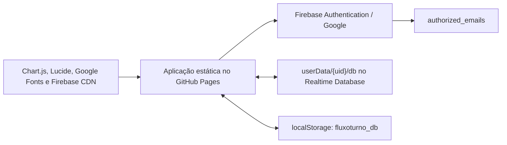

# Auditoria completa do projeto — 22/07/2026

## Resumo executivo

O projeto é um MVP funcional de controle de dias trabalhados e pagamentos, publicado no GitHub Pages e integrado ao Firebase Authentication e ao Firebase Realtime Database. A interface já cobre calendário, pagamentos, estornos, créditos antecipados, preenchimento automático, histórico, configurações, backup manual, português e italiano.

Restrição permanente adicionada em 23/07/2026: todas as etapas devem permanecer compatíveis com GitHub Free e Firebase Spark, sem billing ou Blaze. Serviços pagos não são uma opção de implementação. Consulte `docs/plano-gratuito.md`.

Entretanto, a base de dados ainda corre riscos relevantes antes de novas alterações:

1. cada salvamento substitui todo o objeto do usuário no Realtime Database;
2. o carregamento sempre prefere a nuvem, mesmo quando o dado local pode ser mais recente e ainda não sincronizado;
3. `localStorage` não é separado por usuário e pode ser enviado para uma conta nova;
4. importação e limpeza sobrescrevem a base sem backup obrigatório, validação, transação ou confirmação da gravação remota;
5. erros de gravação no Firebase são apenas registrados no console, enquanto a interface continua informando sucesso;
6. a suíte de testes existente não executa e, se for corrigida superficialmente, pode gravar dados de teste no Firebase de produção.

Conclusão: não é recomendado iniciar pelas melhorias visuais. A etapa zero deve ser proteger, exportar e validar a restauração da base atual. Em seguida devem ser corrigidas persistência, regras de segurança e integridade financeira. Só depois é seguro modularizar, aprimorar a interface e completar a PWA.

## Escopo e evidências

Foram inspecionados todos os arquivos rastreados pelo Git:

- `app.js`: 3.469 linhas;
- `index.html`: 1.070 linhas;
- `style.css`: 2.460 linhas;
- `test.html`: 545 linhas;
- manifesto, ícones, workflow, `.gitignore` e plano anterior.

Também foram verificados:

- sintaxe JavaScript com Node.js 22;
- JSON do manifesto;
- execução real de `index.html` e `test.html` em servidor local;
- estado, histórico, branches e integridade do repositório Git;
- autenticação do GitHub CLI e últimas execuções do GitHub Actions;
- configuração do GitHub Pages e proteção da branch;
- acesso público não autenticado a caminhos do Realtime Database;
- disponibilidade do Firebase CLI.

Nenhum comando de escrita, importação, migração, limpeza ou restauração foi executado no Firebase. A base existente não foi modificada durante esta auditoria.

Limitações verificadas:

- o Firebase CLI identifica a conta configurada, mas as consultas administrativas falharam por credencial inválida e erro local de validação da cadeia TLS; por isso as regras remotas e um backup administrativo ainda precisam ser obtidos após `firebase login --reauth` e correção do certificado local;
- requisições REST sem autenticação a `userData/...` e `authorized_emails` retornaram HTTP 401, o que é positivo, mas não prova que um usuário autenticado não consiga ler ou alterar dados de outro usuário;
- a instalação de validadores adicionais via npm também foi bloqueada pelo mesmo erro de certificado. Não foi desativada a validação TLS para contornar o problema.

## Arquitetura atual



O estado inteiro tem esta forma aproximada:

```text
db
├── settings
├── workedDays/{YYYY-MM-DD}
└── payments[]
```

Cada dia também guarda valores derivados (`status`, `pendingAmount`, `amountPaid`) e referências aos pagamentos (`paymentsApplied`). Cada pagamento repete referências aos dias (`coveredDays`). Essa duplicação exige atualização atômica e reconciliação, que ainda não existem.

## Prioridades

| Prioridade | Significado | Quantidade encontrada |
|---|---|---:|
| P0 | Pode causar perda, mistura ou acesso indevido aos dados; bloqueia novas migrações | 5 |
| P1 | Pode gerar resultado financeiro incorreto ou deixar o sistema sem proteção contra regressões | 8 |
| P2 | Defeito funcional, segurança preventiva, acessibilidade ou manutenção importante | 13 |
| P3 | Melhoria de produto, documentação ou acabamento | 8 |

## Problemas P0 — resolver antes de modificar a base

### P0.1 — salvamento integral com “última gravação vence”

`saveToStorage()` usa `set()` sobre `userData/{uid}/db`, substituindo todo o estado remoto ([app.js](../app.js#L758)). Duas abas, dois dispositivos ou duas gravações concorrentes podem apagar alterações uma da outra.

Impactos:

- perda silenciosa de dias ou pagamentos;
- estorno concorrente com cadastro de dia pode restaurar um estado antigo;
- qualquer novo campo gravado por outra versão do aplicativo pode desaparecer.

Correção:

- escrever somente os caminhos alterados com `update()` multipath;
- para pagamentos, estornos e migrações, usar transação e atualizar pagamento + dias afetados atomicamente;
- incluir `schemaVersion`, `revision`, `updatedAt` do servidor e identificador da operação;
- bloquear a UI durante a operação e só informar sucesso após confirmação do Firebase.

### P0.2 — dado local não sincronizado pode ser descartado

Na inicialização, a nuvem sempre vence se existir ([app.js](../app.js#L686)). Se uma gravação anterior falhou, a versão nova continua no `localStorage`, mas o próximo carregamento recupera a versão antiga da nuvem e substitui a memória sem comparar revisão ou data.

Correção:

- manter fila explícita de operações pendentes;
- comparar revisão local/remota;
- exibir “sincronizado”, “salvando”, “offline” e “erro — alterações apenas neste dispositivo”;
- nunca resolver conflito sobrescrevendo automaticamente; reconciliar registros ou pedir decisão quando necessário.

### P0.3 — armazenamento local compartilhado entre contas

A chave é fixa (`fluxoturno_db`) ([app.js](../app.js#L121)). Quando uma conta ainda não tem dados na nuvem, o sistema carrega essa chave e a envia para o novo UID ([app.js](../app.js#L696)). O logout não remove nem troca o escopo local ([app.js](../app.js#L3424)).

Impacto: dados financeiros de uma pessoa podem aparecer e ser copiados para outra conta usada no mesmo navegador.

Correção:

- usar `fluxoturno_db:{uid}` e guardar apenas depois de conhecer o UID;
- remover imediatamente o estado em memória ao sair;
- decidir se o cache deve ser apagado no logout ou mantido somente em “dispositivo confiável”;
- nunca enviar um cache anônimo para uma conta sem uma confirmação de importação.

### P0.4 — importação e limpeza destrutivas sem rede de segurança

A importação troca `db` diretamente e salva sem validação completa ([app.js](../app.js#L3185)). A limpeza redefine o banco após um único `confirm()` ([app.js](../app.js#L3202)). Nenhuma das operações exige backup recente, aguarda a confirmação remota ou oferece recuperação.

Correção:

- gerar automaticamente um backup pré-operação e seu SHA-256;
- validar o arquivo com schema, versão, datas, IDs, tipos, limites e invariantes financeiras;
- mostrar prévia com quantidade de dias, pagamentos, período e diferenças;
- importar em ambiente temporário e aplicar em transação;
- transformar “apagar” em arquivamento recuperável com retenção;
- exigir confirmação digitada e autenticação recente para exclusão definitiva.

### P0.5 — regras reais do Firebase ainda não estão versionadas nem auditadas

O projeto não contém `firebase.json`, `.firebaserc` nem arquivo de regras. A whitelist e os administradores são verificados no cliente ([app.js](../app.js#L36)), o que controla a interface, mas não é uma barreira de segurança para o banco.

O teste anônimo retornou HTTP 401, mas ainda é obrigatório confirmar que as regras remotas garantem, no mínimo:

- `auth.uid === $uid` em toda leitura e escrita de `userData/$uid`;
- nenhum usuário autenticado comum lê a lista completa de autorizados;
- autorização baseada em UID ou custom claim, não apenas em código JavaScript público;
- validação de tipos, limites e campos permitidos;
- administração da whitelist somente em ambiente confiável.

Essa validação é um gate: nenhuma migração deve ser aplicada antes de exportar e testar as regras no Emulator Suite.

## Problemas P1 — integridade financeira e regressões

### P1.1 — seleção de semanas não limita o pagamento

O código separa os dias em `daysToPay` e `otherDaysToPay`, mas depois percorre os dois grupos ([app.js](../app.js#L2731)). Assim, a seleção apenas muda a prioridade. Um valor maior do que a dívida selecionada é aplicado silenciosamente a semanas não selecionadas em vez de permanecer como crédito ou exigir confirmação.

Correção: definir a regra de negócio e testá-la. Recomendação: com semanas selecionadas, aplicar somente nelas; qualquer excedente vira crédito explicitamente confirmado. Sem seleção, o modo “todas as pendências” deve ser claramente indicado.

### P1.2 — falha remota é apresentada como sucesso

`saveToStorage()` captura a exceção e não a devolve ([app.js](../app.js#L763)). Chamadores exibem alertas de sucesso mesmo que somente o `localStorage` tenha sido atualizado.

Correção: propagar erro, manter a operação na fila, desabilitar ações conflitantes e diferenciar “salvo localmente” de “sincronizado na nuvem”.

### P1.3 — migração altera tarifas válidas silenciosamente

Se a tarifa for exatamente 80 ou 100, ela é convertida em 35 ou 25 em todo carregamento ([app.js](../app.js#L719)). Isso também atinge uma tarifa configurada intencionalmente pelo usuário.

Correção: remover migrações baseadas no valor. Usar `schemaVersion` e migrações idempotentes, registradas e precedidas de backup.

### P1.4 — preenchimento automático pode pular dados definitivamente

O loop limita 370 iterações, mas ao final marca `autoFillLastDate` como hoje ([app.js](../app.js#L2362)). Após um intervalo maior, os dias não processados ficam para trás e nunca serão revisitados.

Correção: salvar como cursor a última data realmente processada, continuar em lotes e exibir progresso. Não avançar o cursor quando um lote falhar.

### P1.5 — suíte de testes está quebrada e não é isolada

`test.html` carrega `app.js` como script clássico ([test.html](../test.html#L197)), mas o arquivo usa imports ES modules. No navegador foram confirmados:

- `SyntaxError: Cannot use import statement outside a module`;
- `ReferenceError: DB_STORAGE_KEY is not defined`;
- zero testes executados.

Os valores esperados ainda são 80/100, enquanto o padrão atual é 35/25. Além disso, a suíte chama `initDatabase()`, `processPayment()` e outras funções que gravam via `saveToStorage()`. Se apenas a tag for mudada para módulo, o teste poderá tocar a produção.

Correção: retirar `test.html` do deploy, separar regras de negócio em módulos puros e usar Vitest + Firebase Emulator Suite. Testes nunca devem importar a configuração de produção.

### P1.6 — importação permite estado inválido e XSS armazenado

A validação atual verifica somente a existência de `settings` e `workedDays` ([app.js](../app.js#L3191)). IDs, datas e outros campos importados são posteriormente interpolados em `innerHTML` e em `onclick`, inclusive `pay.id` ([app.js](../app.js#L2885)). Um backup manipulado pode executar JavaScript na sessão autenticada.

Correção:

- schema estrito com rejeição de propriedades inesperadas;
- IDs e datas em formatos fechados;
- nunca interpolar dado importado em handler inline;
- montar elementos com `textContent` e `addEventListener`;
- adicionar testes de payload malicioso.

### P1.7 — valores monetários usam ponto flutuante

Pagamentos, saldos, rateios e estornos usam `Number`. Operações repetidas podem acumular resíduos e deixar status ou crédito com centavos inconsistentes.

Correção: armazenar e calcular em centavos inteiros. A migração deve converter com arredondamento explícito, gerar relatório de divergências e nunca sobrescrever a base original.

### P1.8 — pagamento e dias não são atualizados atomicamente

`paymentsApplied`, `coveredDays`, `amountPaid`, `pendingAmount`, `status` e `advanceRemaining` são mutados em memória e depois enviados como um objeto integral. Uma interrupção, conflito ou dado legado pode quebrar a relação nos dois sentidos.

Correção: centralizar uma função de domínio que produza uma operação atômica; antes de salvar, validar invariantes e oferecer uma rotina somente de diagnóstico/reconciliação.

Invariantes mínimas:

```text
amountPaid >= 0
pendingAmount = max(0, rate - amountPaid)
soma(paymentsApplied) = amountPaid
pagamento coberto contém todo dia que referencia seu ID
advanceRemaining >= 0
soma aplicada + advanceRemaining = amount do pagamento
```

## Problemas P2 — funcionais, segurança preventiva e manutenção

1. **Total acumulado não é atualizado:** `totalEarnings` é calculado, mas nunca atribuído a `stat-total-earnings` ([app.js](../app.js#L1476)).
2. **Semântica de férias é contraditória:** férias escondem valor/status no calendário, mas os cálculos financeiros excluem apenas `none` e `off`. O campo ainda aceita tarifa customizada ([app.js](../app.js#L2391)). É preciso decidir se férias são pagas.
3. **Ciclo mensal falha em meses curtos:** `setDate(31)` pode avançar para o mês seguinte e produzir contagem incorreta ([app.js](../app.js#L3053)). Deve usar o último dia válido do mês.
4. **Métricas usam conceitos diferentes:** “recebido no mês” é alocado pelo mês trabalhado, o anual usa a data do recebimento e o gráfico usa novamente o mês trabalhado. Os títulos precisam distinguir competência e caixa.
5. **Projeção de crédito pode pular lacunas:** começa depois da maior data já cadastrada; um registro futuro faz dias vazios anteriores serem ignorados ([app.js](../app.js#L1318)).
6. **Projeções do histórico podem se sobrepor:** cada pagamento com crédito projeta datas isoladamente, sem considerar a projeção de outros pagamentos ou todos os dias já registrados ([app.js](../app.js#L2841)).
7. **Lotes sem limite:** intervalos muito grandes constroem milhares de elementos e podem travar a página ([app.js](../app.js#L3232)).
8. **Lote sobrescreve observações:** todo registro processado recebe `notes: 'Lote'`, inclusive registros existentes ([app.js](../app.js#L3314)).
9. **Validação monetária insuficiente:** os inputs não têm `min`, limites superiores nem validação de finitude; tarifas negativas e combinações mistas negativas são possíveis.
10. **IDs frágeis:** pagamentos usam `Date.now()`, sujeito a colisão. Usar `crypto.randomUUID()` ou push IDs do Firebase.
11. **Dependências não reproduzíveis:** Chart.js e Lucide usam URLs sem versão exata (`chart.js` e `@latest`) ([index.html](../index.html#L24)). Não há lockfile, SRI ou build.
12. **Configuração Firebase incoerente:** a chave está no código; o fallback local só seria usado com placeholder, e `index.html` não carrega `firebase-config.js` ([app.js](../app.js#L16)). Chaves web do Firebase não são segredo por si só, mas devem ter restrição de domínio/API e nunca substituir regras corretas.
13. **Ausência de CSP e dependência de handlers inline:** existem 40 handlers inline, dificultando uma Content Security Policy forte. Scripts de terceiros têm acesso aos dados financeiros mantidos no navegador.

## Acessibilidade e experiência

Problemas confirmados estruturalmente:

- seis links de navegação não possuem `href`;
- itens de navegação e dias do calendário clicáveis não possuem papel, `tabindex` ou suporte a Enter/Espaço;
- os três modais não possuem `role="dialog"`, `aria-modal`, nome acessível, foco inicial, aprisionamento de foco ou restauração de foco;
- há botões somente com ícone sem nome acessível;
- cartões de semana clicáveis não expõem seleção para tecnologias assistivas;
- estados dependem fortemente de cor;
- não existe tratamento de `prefers-reduced-motion`;
- os estilos de foco cobrem principalmente inputs, não todas as ações.

Também há 92 estilos inline no HTML, 62 mutações de estilo pelo JavaScript e 25 usos de `!important`, o que dificulta consistência de temas e responsividade.

O plano antigo de layout do calendário está desatualizado: várias propostas já foram implementadas. Há ainda uma regra que tenta esconder `.day-badge span` no modo compacto, mas o texto da badge não é criado dentro de `span`, então a regra não tem efeito ([style.css](../style.css#L1025), [app.js](../app.js#L2130)).

## Infraestrutura, deploy e documentação

Situação atual:

- repositório público;
- apenas branch `master`, sem proteção;
- nenhum tag/release;
- workflow de deploy envia a raiz inteira, inclusive `test.html` e documentos internos ([deploy.yml](../.github/workflows/deploy.yml#L1));
- os últimos pushes geraram duas execuções de Pages por commit: o workflow customizado e o fluxo legado configurado pela branch;
- não existe etapa de lint, teste, validação de regras ou build antes do deploy;
- não existem `README.md`, licença, changelog, instruções de desenvolvimento, documentação do schema ou procedimento de recuperação;
- não existe configuração versionada do Firebase nem ambiente de staging;
- as versões exibidas divergem entre a constante da aplicação e as queries do JavaScript (1.0.53) e CSS (1.0.34); além disso, o hook incrementa a versão até em commits somente de documentação.

Correções:

- escolher um único mecanismo de GitHub Pages;
- publicar somente `dist/`;
- bloquear deploy quando testes/regras/build falharem;
- proteger `master` e trabalhar por PR;
- automatizar versão e cache busting a partir de um único valor;
- adicionar staging e previews;
- documentar configuração, modelo, backup, recuperação e release.

## PWA e confiabilidade operacional

O manifesto e os ícones são válidos, mas não existe service worker. Portanto, o projeto apresenta metadados de PWA sem cache offline real. Deve-se escolher:

- completar a PWA com service worker, estratégia de atualização e página offline; ou
- remover promessas de funcionamento offline e manter apenas o atalho instalável.

Também faltam:

- indicador de versão nova disponível;
- monitoramento de erros com remoção de dados pessoais;
- health check de autenticação/banco;
- telemetria de falhas de sincronização;
- rotina agendada de backup e teste periódico de restauração.

## Roteiro seguro de implementação

### Etapa 0 — preservar a base atual

Objetivo: garantir recuperação antes de qualquer alteração de persistência.

Status em 22/07/2026: **concluída localmente**. Exportação administrativa, criptografia, hash canônico, restauração no emulador e tarefa diária com retenção de 30 dias foram validados. O backup nativo permanece indisponível no plano Spark, e uma cópia off-site ainda depende da escolha do destino e da estratégia de chave. Consulte `plans/etapa-0-backup-e-restauracao.md`.

1. corrigir a cadeia de certificados do Node/Firebase CLI sem desabilitar TLS;
2. executar `firebase login --reauth` de forma interativa;
3. confirmar projeto e instância corretos;
4. exportar o Realtime Database completo para pasta fora do repositório;
5. exportar também regras, configuração de autenticação e lista de usuários/autorizados;
6. calcular SHA-256 e registrar data, projeto, instância e tamanho;
7. criptografar o backup, pois contém dados pessoais/financeiros;
8. restaurar uma cópia somente no Emulator Suite ou projeto de staging;
9. comparar contagens, totais e invariantes;
10. ativar backup automático e política de retenção compatível com o plano Firebase.

Comando de exportação a executar somente após reautenticar e confirmar projeto/instância:

```powershell
firebase database:get / --project dias-trabalhados-bf99a --export --pretty --output "D:\Backups\dias_trabalhados_2\rtdb-AAAA-MM-DD-HHMM.json"
Get-FileHash "D:\Backups\dias_trabalhados_2\rtdb-AAAA-MM-DD-HHMM.json" -Algorithm SHA256
```

Nunca colocar esse arquivo no Git. Nunca testar restauração sobre a produção.

Critério de saída: backup íntegro e restauração validada em ambiente descartável.

### Etapa 1 — criar base de engenharia isolada

Objetivo: poder mudar sem tocar a produção durante testes.

Status em 22/07/2026: **concluída**. Build Vite, módulos de domínio/persistência/Firebase/UI, bloqueio de produção, 23 testes unitários, 5 testes de regras e 2 fluxos Playwright em Auth/Database Emulators foram validados. Os gráficos passaram a carregamento sob demanda e o chunk inicial caiu de aproximadamente 539 KB para 328 KB. Consulte `plans/etapa-1-base-engenharia.md` e `docs/arquitetura.md`.

- adicionar `package.json`, lockfile e Vite;
- separar `domain/`, `persistence/`, `firebase/` e `ui/`;
- adicionar `firebase.json`, regras e emuladores;
- criar projeto/alias de staging;
- migrar `test.html` para Vitest e Playwright;
- impedir por código que testes aceitem o project ID de produção.

Critério de saída: testes rodam localmente e no CI com rede de produção bloqueada.

### Etapa 2 — corrigir persistência e segurança

Objetivo: eliminar perda silenciosa e isolamento incorreto.

Status em 23/07/2026: **critério técnico local concluído**. Cache e fila por UID, patches atômicos, assinatura remota, schema 2, migrações, importação validada, recuperação local e regras candidatas foram testados. Duas sessões preservaram alterações distintas e o isolamento entre UIDs foi comprovado no Emulator. A migração manteve os invariantes das duas bases do backup real. Nenhuma mudança foi aplicada em produção; consulte `plans/etapa-2-persistencia-seguranca.md`.

- cache por UID;
- gravações granulares/atômicas;
- fila e estado de sincronização;
- regras por UID/custom claim;
- erros propagados à interface;
- schema versionado e migrações idempotentes;
- importação segura e exclusão recuperável;
- restrição da chave web e App Check, depois de regras corretas.

Critério de saída: testes concorrentes em duas sessões não perdem alterações e um UID nunca acessa outro.

### Etapa 3 — corrigir o domínio financeiro

Objetivo: garantir que os números exibidos representam uma regra explícita.

- centavos inteiros;
- seleção de semanas realmente restritiva;
- reconciliação pagamento/dia;
- total acumulado;
- férias;
- competência versus caixa;
- crédito, projeção e estorno;
- auto preenchimento paginado;
- datas mensais e fusos/DST;
- validação de todos os limites.

Critério de saída: matriz de casos unitários, incluindo pagamentos parciais, múltiplos pagamentos, excedente, estorno, mudança de tarifa, anos/meses e dados legados.

### Etapa 4 — interface, acessibilidade e desempenho

Objetivo: melhorar a experiência sobre uma base confiável.

- remover handlers e estilos inline;
- transformar ações em elementos semânticos;
- implementar modais acessíveis;
- revisar contraste, foco, teclado e movimento reduzido;
- limitar/paginar lotes e semanas;
- substituir `alert/confirm` por feedback não bloqueante e diálogos seguros;
- finalizar o calendário responsivo e atualizar/remover o plano antigo.

Critério de saída: fluxo completo utilizável por teclado e auditado em desktop/mobile.

### Etapa 5 — build, deploy e operação

Objetivo: publicar somente artefatos validados e recuperar falhas rapidamente.

- dependências fixadas e atualizadas de forma controlada;
- CSP e headers possíveis para a plataforma escolhida;
- CI com lint, unitários, integração de regras, E2E e build;
- um único deploy Pages a partir de `dist/`;
- branch protegida, PR e rollback documentado;
- release/tag/changelog;
- monitoramento, backup automático e ensaio periódico de restauração;
- decidir e completar service worker ou retirar a expectativa de offline.

Critério de saída: release reproduzível, observável e reversível.

## Decisões de produto necessárias antes da Etapa 3

1. Férias têm valor financeiro ou são apenas um marcador?
2. “Recebido no mês” significa data do recebimento (caixa) ou mês trabalhado (competência)?
3. Excedente de uma semana selecionada deve virar crédito ou pagar outras semanas?
4. Uma conta representa sempre uma base independente ou haverá compartilhamento entre usuários?
5. O aplicativo deve funcionar offline com edições ou apenas visualizar cache?
6. Ao sair, o cache financeiro deve ser apagado ou mantido em dispositivo confiável?
7. Dias gerados automaticamente devem mudar retroativamente quando a rotina/tarifa muda?

## O que falta para considerar o projeto completo

- backup e restauração comprovados;
- regras versionadas e testadas;
- ambiente staging/emulador;
- sincronização sem sobrescrita integral;
- cache isolado por usuário;
- migrações versionadas;
- importação e exclusão recuperáveis;
- domínio financeiro coberto por testes;
- suíte automatizada isolada da produção;
- validação de dados e proteção contra XSS;
- acessibilidade básica de teclado/modais;
- build reproduzível com dependências fixas;
- CI antes do deploy;
- um único pipeline de Pages;
- README, schema, runbook de backup/restore e changelog;
- monitoramento de erros e falhas de sincronização;
- decisão explícita sobre PWA/offline.

## Ordem recomendada para a próxima execução

1. reautenticar o Firebase CLI e corrigir o certificado local;
2. fazer e validar o backup da Etapa 0;
3. versionar as regras atuais sem alterá-las;
4. criar staging/emuladores e substituir a suíte insegura;
5. corrigir P0.1–P0.4 e P1.1–P1.4;
6. só então iniciar melhorias visuais e novas funcionalidades.
